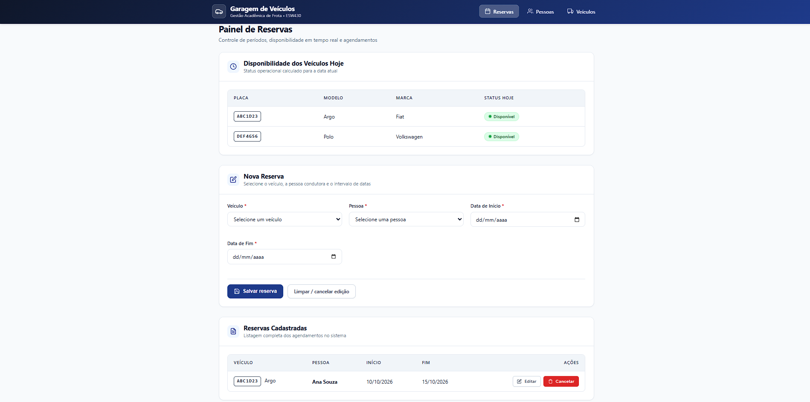
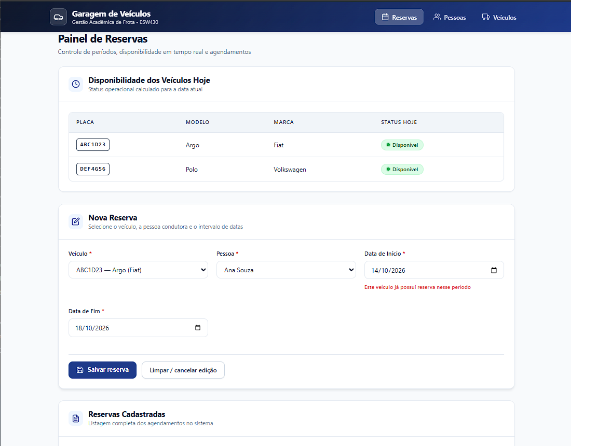

# Garagem de Veículos

Sistema da disciplina **Arquitetura de Software — ESW430 — UniRV**.

## Integrantes

- João Henrique
- Gustavo Lopes
- João Victor

## Tecnologias e execução

Java 17+, Maven 3.8+, Spring Boot 3.3.4, Thymeleaf e Jackson.
Na pasta que contém `pom.xml`:

```sh
mvn test
mvn spring-boot:run
```

Abra http://localhost:8080. A página inicial é **Reservas**.
Pare com Ctrl+C e execute novamente para verificar a persistência.
Os arquivos ficam em `data/`, relativos à pasta de execução. Execute sempre na raiz do projeto.

## Entregas

- Pessoas: listar, cadastrar, editar e excluir; CPF único.
- Veículos: CRUD com placa única, marca, modelo, ano e cor opcional.
- Reservas: criar escolhendo pessoa e veículo, editar o período e cancelar.
- Disponibilidade de cada veículo calculada na data de hoje.
- Início e fim são inclusivos. Uma reserva de 10/10 a 15/10 bloqueia outra começando em 15/10.
- Datas invertidas, referências inexistentes e conflitos retornam erros no formulário.
- JSON de exemplo com duas pessoas, dois veículos e uma reserva.

## Arquitetura e SOLID

View → Controller → interface do repositório → repositório JSON.
Em Reservas, o Controller também usa ReservaService para validar o período e os vínculos.

| Princípio | Aplicação |
| --- | --- |
| S | Models contêm dados e validações; repositórios persistem; serviço valida reservas; controllers coordenam telas. |
| O | Uma implementação de banco pode substituir o repositório JSON sem alterar controllers e views. |
| L | Controllers usam os contratos; os testes substituem repositórios por mocks. |
| I | Cada entidade possui sua própria interface de repositório. |
| D | Interfaces e serviço são recebidos por construtor; Spring entrega as dependências. |

Cada entidade possui Model, Interface, Repository, Controller e Views.
Reserva usa o formulário na própria página `reserva/index.html`.
A sobreposição é verificada por `IReservaRepository.existeConflito`, ignorando o Id da reserva em edição.
ReservaService valida, chama a verificação e grava apenas quando não há erros.
O ObjectMapper injetado pelo Spring suporta LocalDate; datas ficam como `yyyy-MM-dd` no JSON.

## Testes e evidências

Execute `mvn test` para testar os limites de conflito, edição, referências inexistentes,
CRUD e persistência por nova instância do repositório, validações e renderização das páginas.

**Estado de validação desta atualização:** 
A aplicação foi executada localmente com Java 17 e Maven.
A primeira execução dos testes apresentou 11 testes aprovados,
sem falhas, erros ou testes ignorados.
A interface foi atualizada com auxílio do Antigravity.

Consulte [docs/VALIDACAO.md](docs/VALIDACAO.md) para o roteiro manual e prints exigidos.
Os prints estão disponíveis na seção Evidências da Entrega 2.

## Ferramentas de IA utilizadas

- Claude (Anthropic): geração e revisão da primeira entrega.
- ChatGPT / Codex (OpenAI): implementação e revisão de Veículos e Reservas e preparação de testes.
- Antigravity: melhoria visual das páginas Thymeleaf e do CSS.

## Limitações

A exclusão de pessoa ou veículo com reservas não é bloqueada (desafio opcional).
Reservas antigas continuam listadas com indicação de cadastro excluído.
A aplicação utiliza arquivos locais e é destinada ao uso acadêmico em uma única instância.

## Evidências da Entrega 2




